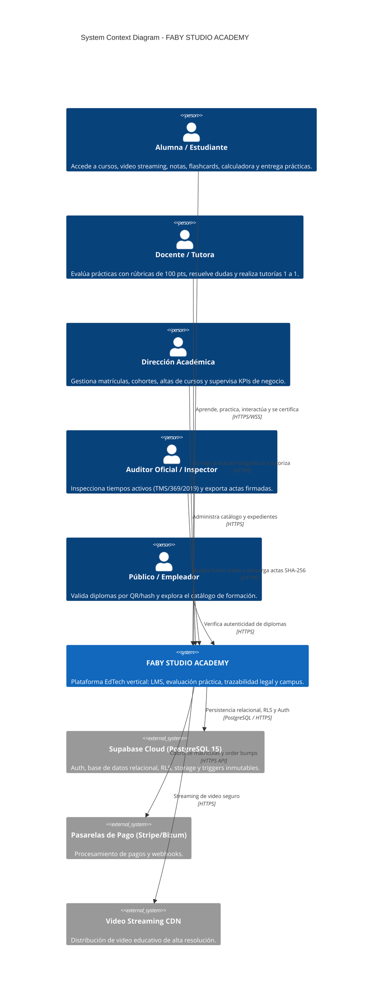
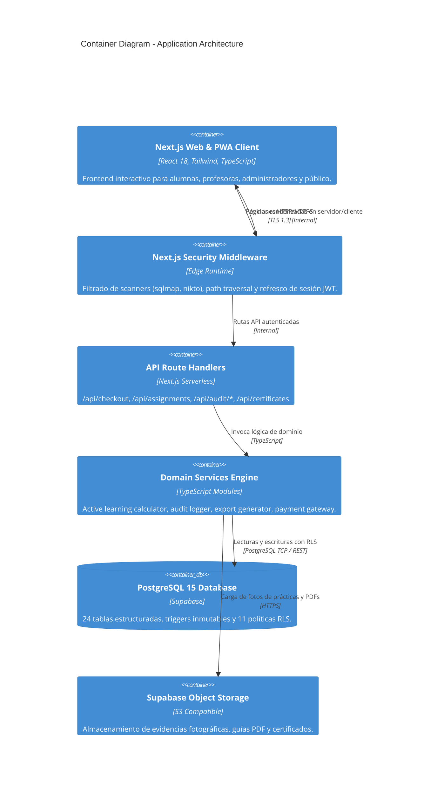

# 🏛️ Current Architecture Audit — FABY STUDIO ACADEMY

**Document Version:** 1.0.0  
**Status:** Audited & Verified  
**Date:** Agosto 2026  
**System Classification:** Vertical EdTech & LMS Modular Monolith (Hybrid Demo & Supabase Cloud)

---

## 1. Executive Summary & Stack Overview

FABY STUDIO ACADEMY is built as a high-performance **Modular Monolith** using Next.js 14 (App Router) on Vercel Fluid Compute, backed by PostgreSQL 15 on Supabase with Row Level Security (RLS) and cryptographic append-only event logging.

### Core Technology Stack

| Layer | Technology | Version / Specification | Rationale & Status |
| :--- | :--- | :--- | :--- |
| **Framework** | Next.js (App Router) | `14.2.24` | React Server Components + Client Workspaces |
| **Language** | TypeScript | `5.7.3` (Strict Mode) | Zero build-time type errors (`tsc --noEmit`) |
| **Styling** | Tailwind CSS + Vanilla CSS | `3.4.17` | Bespoke luxury aesthetic, responsive design system |
| **Icons** | Lucide React | `0.475.0` | Comprehensive semantic icon set |
| **Database** | PostgreSQL 15 (Supabase) | `@supabase/ssr` `0.5.2` | 24 tables, 11 RLS policies, append-only triggers |
| **Client Auth/DB** | `@supabase/supabase-js` | `2.48.1` | Cookie-based session handling via Next.js middleware |
| **Testing** | Vitest + Playwright | Vitest `3.0.5`, Playwright `1.50.1` | Unit + E2E integration test harnesses |
| **Deployment** | Vercel Edge / Fluid Compute | Node.js 20.x | Global edge caching & WAF protection |

---

## 2. Simplified C4 Architecture Model

### C4 Level 1: System Context Diagram



---

### C4 Level 2: Container Diagram



---

## 3. Modular Domain Organization

The codebase is organized into discrete domain packages within `src/`:

```
src/
├── app/                        # Next.js App Router Tree
│   ├── (public)/               # Public Funnel (Landing, Catálogo, Checkout, Login)
│   ├── campus/                 # Student LMS Experience (Player, Flashcards, Calculadora, etc.)
│   ├── profesor/               # Teacher Portal (Buzón de Rúbricas, Expedientes, Cursos)
│   ├── admin/                  # Academic Operations & Direction
│   ├── auditoria/              # TMS/369 Inspection & Audit Log Suite
│   ├── verificar-certificado/  # Public Certificate Verification Portal
│   └── api/                    # Serverless API Handlers
├── components/                 # Component Library
│   ├── layout/                 # Public & Campus Navigation Shells
│   ├── shared/                 # FabyAIAssistant, BeforeAfterSlider, VisualFeedbackAnnotator, StreakTracker
│   └── ui/                     # Primitives
├── lib/                        # Domain Engines & Utilities
│   ├── supabase/               # Browser, Server, Middleware clients
│   ├── active-learning-calculator.ts # Heartbeat & TMS/369 time engine
│   ├── audit-logger.ts         # Append-only activity logger with SHA-256 IP hashing
│   ├── export-generator.ts     # Inspection act generator (PDF/CSV/XLSX/JSON)
│   ├── calendar-sync.ts        # Google / Outlook / Apple iCal sync
│   └── services-demo/          # Deterministic in-memory sandbox fallbacks
└── types/                      # Global TypeScript Definitions
```

---

## 4. Current State Classification: Dual-Mode Architecture

The platform operates on an intelligent **Hybrid Dual-Mode**:
1. **Cloud Production Mode**: When `NEXT_PUBLIC_SUPABASE_URL` and `NEXT_PUBLIC_SUPABASE_ANON_KEY` point to a live Supabase project, all data reads and writes run through PostgreSQL with active RLS and trigger enforcement.
2. **Sandbox / Demo Fallback Mode**: When running in unlinked local environments or demo presentations, fallback services (`src/lib/services-demo/*`) provide instant state persistence and deterministic data to prevent UI breakdown.
