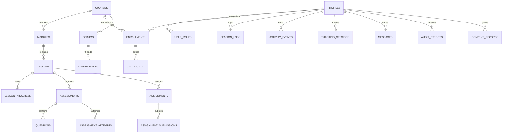

# 🗄️ Database Architecture & RLS Audit — FABY STUDIO ACADEMY

**Document Version:** 1.0.0  
**Target Engine:** PostgreSQL 15+ (Supabase)  
**Audit Date:** Agosto 2026

---

## 1. Schema Inventory: 24 Structured Tables

The current relational schema resides in [`supabase/migrations/20260808000000_faby_academy_schema.sql`](file:///c:/Users/LENOVO/Desktop/fabi%20studio/supabase/migrations/20260808000000_faby_academy_schema.sql):



### Table Breakdown by Domain

1. **Identity & RBAC**:
   * `public.profiles`: Core user identities referencing `auth.users(id)`.
   * `public.user_roles`: Role assignment (`alumna`, `tutor`, `profesor`, `admin_academico`, `superadmin`, `auditor`).
2. **Academic Catalog & Content**:
   * `public.courses`: Master course metadata, hours, publish state, category.
   * `public.modules`: Course modules with ordering.
   * `public.lessons`: Lecciones multimedia (`video`, `pdf`, `quiz`, `text`).
3. **Enrollments & Active Learning (TMS/369/2019)**:
   * `public.enrollments`: Active and completed student course access.
   * `public.lesson_progress`: Per-lesson active study time and status.
   * `public.session_logs`: Session duration, heartbeat tracker, and active flag.
   * `public.activity_events`: **Append-only immutable event ledger** with SHA-256 IP hash.
4. **Evaluation & Tutoring**:
   * `public.assessments`: Quizzes and theoretical exams.
   * `public.questions`: Multiple choice and rubric questions.
   * `public.assessment_attempts`: Scored student quiz attempts.
   * `public.assignments`: Practical model submissions.
   * `public.assignment_submissions`: Graded student photo submissions with feedback.
   * `public.tutoring_sessions`: 1-on-1 scheduled mentor meetings.
5. **Community & Communications**:
   * `public.forums`: Course debate boards.
   * `public.forum_posts`: Nested discussion threads.
   * `public.messages`: 1-to-1 direct teacher-student messages.
6. **Certificates & Legal Audit**:
   * `public.certificates`: Verified diplomas with SHA-256 integrity hash signatures.
   * `public.audit_exports`: Immutable log of generated labor inspection files.
   * `public.consent_records`: Explicit RGPD consent tracking.
   * `public.privacy_policy_versions`: Versioned privacy policies.
   * `public.data_deletion_requests`: RGPD right to erasure tracking.
   * `public.data_retention_policies`: Automated category retention definitions.

---

## 2. Row Level Security (RLS) & Immutability Audit

### RLS Policies Status: 100% Active

Every table has `ALTER TABLE ... ENABLE ROW LEVEL SECURITY;` applied.

* **Append-Only Trigger Enforcement**:
  ```sql
  CREATE OR REPLACE FUNCTION public.prevent_activity_event_tampering()
  RETURNS TRIGGER LANGUAGE plpgsql AS $$
  BEGIN
    RAISE EXCEPTION 'Immutable Table: UPDATE and DELETE operations are strictly prohibited on activity_events for audit compliance.';
  END;
  $$;

  CREATE TRIGGER trg_protect_activity_events
  BEFORE UPDATE OR DELETE ON public.activity_events
  FOR EACH ROW EXECUTE FUNCTION public.prevent_activity_event_tampering();
  ```
* **Auditor Role Read-Only Privileges**:
  Auditors have broad `SELECT` privileges via helper function `is_auditor_or_admin(auth.uid())` without any `INSERT`, `UPDATE` or `DELETE` rights on student grades or courses.

---

## 3. Database Evolution Plan for Faby Skills Platform

To support the **Skill Graph, Living Curriculum, and Evidence Engine**, the following entities are planned for upcoming migrations:

1. `public.skills`: Individual competencies (`Preparación de placa`, `Manicura Rusa`, `Acrigel`, `Diseño de mirada`).
2. `public.course_skills`: Many-to-many relationship linking courses/modules to target competencies.
3. `public.student_skills`: Verified proficiency levels per student (`score`, `confidence`, `verified_at`).
4. `public.skill_evidence`: Multi-factor evidence linkage (`theory_quiz_id`, `photo_submission_id`, `rubric_review_id`, `instructor_id`).
5. `public.course_versions`: Living Curriculum history (`v1.0`, `v1.1`, changelog, affected cohorts).
