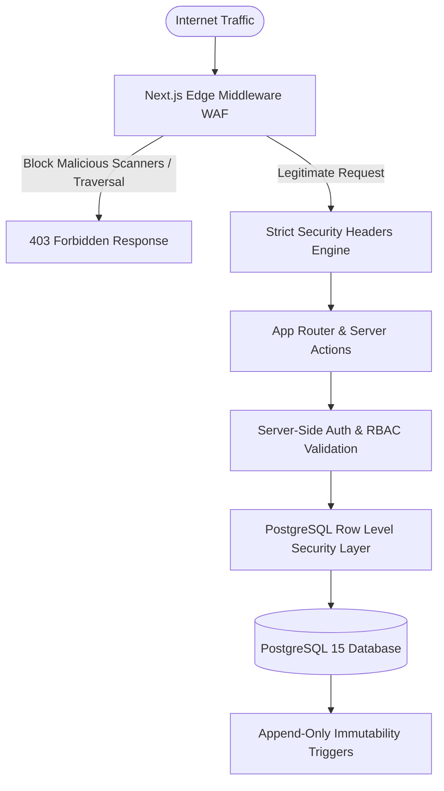

# 🛡️ Cybersecurity, Privacy & Threat Model Audit — FABY STUDIO ACADEMY

**Document Version:** 1.0.0  
**Security Classification:** Enterprise Hardened  
**Audit Date:** Agosto 2026

---

## 1. Threat Matrix & Defense-in-Depth Model

---

## 2. Hardened Security Layers Currently Active

### Layer 1: Edge Middleware WAF ([`src/middleware.ts`](file:///c:/Users/LENOVO/Desktop/fabi%20studio/src/middleware.ts))
* **Malicious Scanner Blocker**: Detects and drops automated vulnerability reconnaissance signatures (`sqlmap`, `nikto`, `wpscan`, `acunetix`, `dirbuster`, `havij`, `masscan`, `nmap`, `nessus`, `openvas`).
* **Anti Path-Traversal**: Rejects probes targeting `/etc/passwd`, `..%2f`, `..\\`, `.git/` and `.env`.
* **Session Refresh**: Executes transparent Supabase JWT token refresh via cookies (`updateSession`) to prevent mid-lesson session expiration.

### Layer 2: HTTP Security Headers ([`next.config.mjs`](file:///c:/Users/LENOVO/Desktop/fabi%20studio/next.config.mjs))
* **Content-Security-Policy (CSP)**: Restricts scripts, frames, and connections to verified origins (YouTube nocookie, Supabase, Stripe, Google Fonts).
* **Strict-Transport-Security (HSTS)**: `max-age=63072000; includeSubDomains; preload` forcing HTTPS.
* **X-Frame-Options: SAMEORIGIN**: Defends against Clickjacking attacks.
* **X-Content-Type-Options: nosniff**: Defends against MIME sniffing exploits.
* **poweredByHeader: false**: Hides framework fingerprinting.

### Layer 3: Database & Immutability ([`20260808000000_faby_academy_schema.sql`](file:///c:/Users/LENOVO/Desktop/fabi%20studio/supabase/migrations/20260808000000_faby_academy_schema.sql))
* **RLS Across All 24 Tables**: Each student only reads and writes their own records.
* **Append-Only Immutability Trigger**: `prevent_activity_event_tampering` raises PostgreSQL exceptions on any attempted `UPDATE` or `DELETE` on `activity_events` or `audit_exports`.

### Layer 4: RGPD Privacy & Anonymization ([`src/lib/audit-logger.ts`](file:///c:/Users/LENOVO/Desktop/fabi%20studio/src/lib/audit-logger.ts))
* **IP Hashing**: Client IP addresses are never stored in plaintext. They are hashed using `SHA-256(IP + Salt)` to prevent personal data exposure.
* **Explicit Consents**: Consent records tracked in `consent_records` with right to erasure workflows.

---

## 3. Secret Isolation & API Security Checklist

* [x] `SUPABASE_SERVICE_ROLE_KEY` is strictly confined to server-side executions and never prefixed with `NEXT_PUBLIC_`.
* [x] Payment credentials (`STRIPE_SECRET_KEY`, `STRIPE_WEBHOOK_SECRET`) isolated in backend route handlers.
* [x] Student practice photos served with privacy-preserving object paths.
